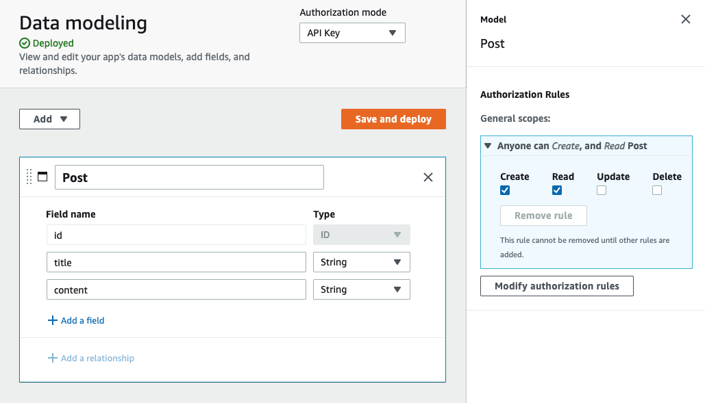

# Next.js with Amplify DataStore

This project implements markdown rendering, build time data fetching, dynamic routes to pre-render based on data, SSR, fallback routes, revalidation, and client data fetching using Amplify DataStore and Next.js.

The back end for this project is implemented with [Amplify Admin UI](https://sandbox.amplifyapp.com/) using the following data model:

This project goes along with my live coding video [here](https://www.youtube.com/watch?v=bQ1Giqn5G38)

To learn more about what is happening in this project, check out these files: __pages/\_app.js__, __pages/index.js__, and __pages/posts/[id].js__.
